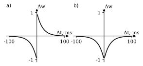

# __Spiking neural networks training with combined Hebbian rules__
***
The code illustrates the result reported at the [ITNT-2024](https://itnt-conf.org/index.php/en) conference and published in [IEEE Xplore](https://ieeexplore.ieee.org/stamp/stamp.jsp?tp=&arnumber=10582358&isnumber=10582284)

### ARTICLE:   
D. Antonov, B. Batuev and S. Sukhov, "Spiking Neural Networks Training with Combined Hebbian Rules," 2024 X International Conference on Information Technology and Nanotechnology (ITNT), Samara, Russian Federation, 2024, pp. 1-5.    
doi: 10.1109/ITNT60778.2024.10582358.
***
Abstract: The article presents a novel local learning rule for __spiking neural networks__ (SNNs). The developed Supervised Learning method uses a combination of Hebbian rules, so-called spike-time-dependent plasticity (__STDP__) and all-time long-term depression (__all-LTD__). The rules, characteristic of biological neurons, together with lateral inhibition and an adaptive threshold, allow us to find the unique input features for every class of objects. Two series of experiments were carried out with and without an adaptive threshold. The classification accuracy was (74.9 ± 19.8)% in experiments without an adaptive threshold and (80.0 ±13.0)% in experiments with an adaptive threshold. SNNs were implemented in the [Brian 2.0](https://brian2.readthedocs.io/en/2.0/index.html) package. Experiments were carried out on a freely available dataset of handwritten digits images MNIST. 
***
__The code is written in Python 3.8 using the [Brian 2.0](https://brian2.readthedocs.io/en/2.0/index.html) framework__
***
The __STDP__ rule for artificial neurons adjusts the connection strengths based on the relative timing of a particular neuron's output and input. According to this rule, the strength of the synaptic connection changes depending on the time difference in the excitation of spikes in the pre- and postsynaptic neurons (see on Fig. a). Thus, the STDP rule is based on the principle of causality:   
- if the presynaptic spike precedes the postsynaptic one (in a period of less than _50 msec_), then _Δt>0_, and the connection is strengthened,   
- if, on the contrary, the postsynaptic spike precedes the presynaptic one (in the same period), then _Δt<0_ and the synaptic connection decreases.     

The STDP mechanism by itself provides the sensitivity of postsynaptic neurons to the specific features of the input signal irrespective of their attribution to a specific class. However, for Supervised Learning to take place, each neuron, on the one hand, must learn the features of _“its class”_, and on the other hand, ignore the features of alien classes' objects.   

 Such insensitivity of neurons to _"alien classes"_ features is provided by the __all-LTD__ rule (all-time synaptic depression):   
 - if pre- and postsynaptic spikes both fall within the interval |Δt| (within the same period of 50 msec), the connection strength between the neurons decreases.    
 
 This mechanism of synaptic connection change is illustrated in Fig. b.   
 
   

***

The network on which experiments on the application of the complex rule __'STDR+all-LTD'__ consists of two layers: the first input layer contains Poisson neurons, the second layer consists of an equal number of excitatory and inhibitory neurons. Connections between excitatory and inhibitory neurons allow the most active excitatory neurons to reduce the activity of their neighbors, thereby exerting lateral inhibition. Lateral inhibition allows each of the excitatory neurons to highlight its own unique feature and to mute common features in the input data.
The operation of the SNN (see Fig.) consists of performing the following steps when each training image is received as input:   
- Each pixel of the input data falls on the corresponding Poisson layer neuron, which generates a sequence of spikes with an average frequency equal to the intensity of the given pixel, i.e. frequency coding of data occurs.
- From Poisson neurons, the signal travels through synapses of the _S1_ group to the excitatory neurons of the second layer. These _S1_ group’s synapses connect Poisson neurons with excitatory neurons according to the _one-to-all manner_.
- The spikes, arriving at the excitatory neurons, lead to an increase in the neuronal membrane potential V. When membrane potential _V_ reachs the threshold level _V_thres_, exitatory neuron generates spikes. These spikes pass through the _S2_ group's synapses to the inhibitory neurons of the second layer. Each spike from an excitatory neuron will trigger a spike of the corresponding inhibitory neuron since the synapses of the _S2_ group connect them in a _one-to-one manner_. The weights of the _S2_ group’s synapses remain constant.
- The signal from inhibitory neurons goes back to excitatory neurons according to the _one-to-all-except-initiating manner_ through the synapses of the _S3_ group. The weights of the _S3_ group also remain constant; such a connection provides lateral inhibition.
  

When training a network, data is received sequentially one at a time. After the generation of spikes evoked by a single image for _350 msec_, there is a rest period of _150 msec_ in the absence of input signals. During the resting period, the potential of the excitatory neurons drops to a lower threshold, after which the loop is repeated in the subsequent image.
***
The logic behind the operation of the canonical STDP mechanism is to causally strengthen the corresponding synaptic connection, which allows the neuron to identify repeating sequences in the input signal (to highlight the characteristic features of the signal).   
To implement Supervised Learning, _we have made some changes to the learning design_. __We divided the excitatory neurons of the second layer into subgroups, the number of subgroups is equal to the number of data classes and the size of these subgroups is the same.__   
The subgroup number is mapped to the class number, so that if a spike from a Poisson neuron arrives at a subgroup of excitatory neurons with the same number as the class number, then this action results in the correct classification.   
The learning process occurs as follows. __When a signal of a certain class is applied to the input of the network, excitatory neurons designed to recognize the target class are trained using the STDP rule, and the rest of the neurons responsible for recognizing other classes are trained using the all-LTD rule. This process is repeated sequentially for all samples from the training set.__ 
***
***
